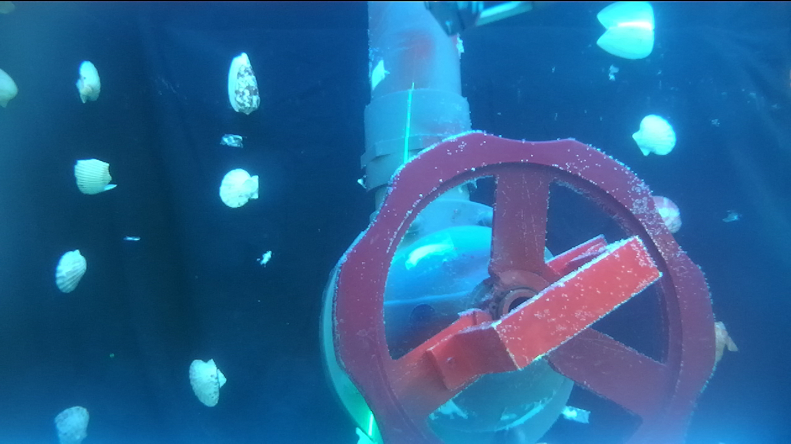
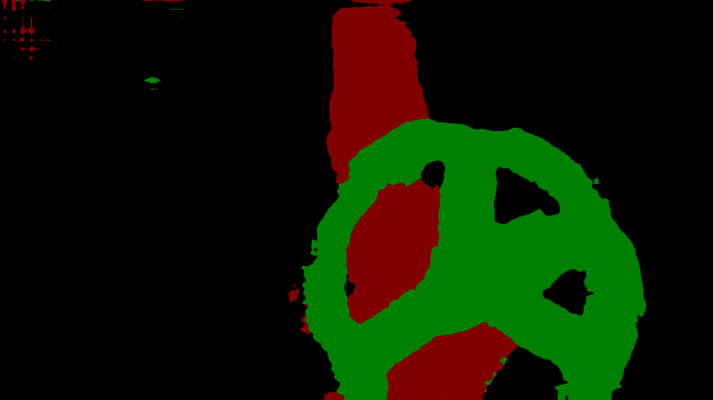

RGB MASK to COCO  

# 基于DeepLab V1 的Image Segmentation项目  
# 数据集：水下管道（有光/无光）  
## 目标： 
  ### 探究Illumination对ImageSegmentation的影响，通过修改Loss，注意力模块，mask精度等方式进行测试  
# Label：RGB MASK 背景-管道-阀门  
# 模型评价标准：Mean IoU （0.755测试集）  
<br/>  

## 训练条件：Tensorflow-gpu 1.4.0+Python3.5+Cuda8+windows10
## 数据集分为：亮光下的水下阀门和暗光下的水下阀门，其中，亮光下的阀门较清晰，识别比较容易，而暗光下的阀门则不然，不仅整体偏暗，而且还有一些明显的激光线，对模型训练和识别有着较大的影响  

原始训练集使用的是VOC2012的RGB格式MASK,还需要再次进行转换  
```python
def convert_from_color_segmentation(arr_3d):
  arr_2d = np.zeros((arr_3d.shape[0], arr_3d.shape[1] ), dtype = np.uint8)
  for c , i in palette.items():
    m = np.all(arr_3d == np.array(c).reshape(1,1,3), axis = 2)
    arr_2d[m] = i
  return arr_2d;
```
使用该函数处理的到的mask进行训练  
Background  | Pipe  | Valve
 ---- | ----- | ------  
 (0,0,0) | (128,0,0) | (0,128,0)  
 
  ## 测试样例
  
  ## 预测结果
  
